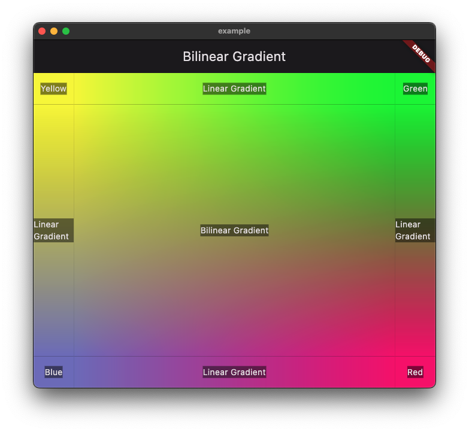

<!--
This README describes the package. If you publish this package to pub.dev,
this README's contents appear on the landing page for your package.

For information about how to write a good package README, see the guide for
[writing package pages](https://dart.dev/guides/libraries/writing-package-pages).

For general information about developing packages, see the Dart guide for
[creating packages](https://dart.dev/guides/libraries/create-library-packages)
and the Flutter guide for
[developing packages and plugins](https://flutter.dev/developing-packages).
-->

# Bilinear Gradient

## Features

This package will allow you to draw the `BilinearGradientDecorator` widget, as `LinearGradient` is already built in with Flutter.



But don't confuse the `Container`'s `LinearGradient` with the `BilinearGradientDecorator`, since the former is an attribute of a `Container`'s decoration, while the latter is a stand alone `Widget`.

## Usage


```dart
import 'package:bilinear_gradient/bilinear_gradient.dart';
...

const topLeftColor = Color(0xFFF7F700);
const topRightColor = Color(0xFF00F700);
const bottomLeftColor = Color(0xFF7675C3);
const bottomRightColor = Color(0xFFF70075);

...
child: BilinearGradientDecorator(
        topLeftColor: topLeftColor,
        topRightColor: topRightColor,
        bottomLeftColor: bottomLeftColor,
        bottomRightColor: bottomRightColor,
        child: Center(
            child: DecoratedText('Bilinear Gradient')
        ),
    )
...
```

## Additional information
- Tested on Android/iOS/macOS with Flutter 3.7.0. Web did't worked on that version;
- Tested again in with Flutter 3.10.5. Everything work just fine at this time.
